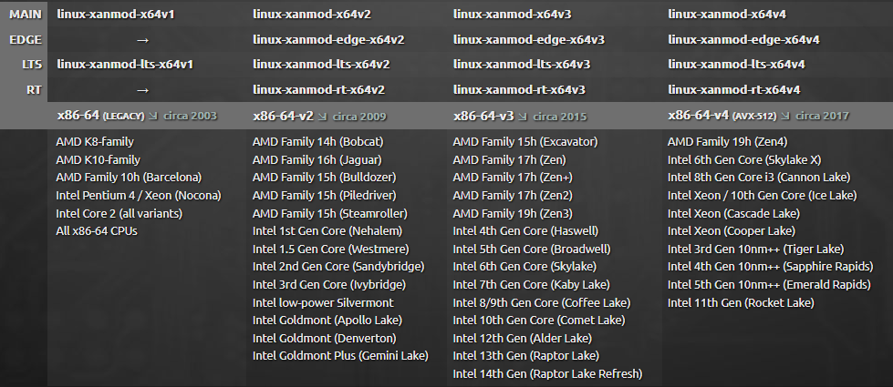

### **Xanmod-Kernel-Builder**
An straightforward workflow for building the Xanmod kernel on your device.

This workflow facilitates the creation of a Xanmod kernel, incorporating multiple versions of **Clang/LLVM** with **`LLVM=1`** and **`LLVM_IAS=1`** specifically tailored for debian/ubuntu distros. (Can be adapted for Arch Linux with ease)

It utilizes the following script to set up LLVM: https://apt.llvm.org/llvm.sh

The kernel is built with Clang/LLVM 19, the latest version at the time of writing.

The configuration in the repository builds a kernel tailored to my laptop (**DO NOT** use it).

- `build` creates a non-generic kernel, utilizing the `config` in the repository.
- `build_generic` generates a generic kernel (building 4 versions) with `Full LTO` and `CONFIG_PREEMPT=y`, using `config_general` in the repository.


Kanged from: https://xanmod.org/ (xanmod website)

#### Notice

1. GitHub Actions service is NOT unlimited, so to prevent waste, use a stable and tested configuration locally first, then edit the config file in the repository.

2. Before making any changes, ensure that the repository belongs to you. "Fork" it if you intend to commit code; otherwise, use "Use this template".


 shamelessly kanged instructions from **[here](https://github.com/azwhikaru/Action-TWRP-Builder)**


#### **To easily create a device-specfic config here is a noob-friendly guide**

`// if you dont want to make a config just use the generic builds //` 

#### **Prerequisites:**
```> Basic command-line experience , like using `cd` , basic `bash` etc. ```

```> Approximately 10-20 GB of free disk space, depending on your configuration.```


1. Install the Xanmod kernel you want to build; for example, to build kernel `6.1 LTS`, install the official Xanmod 6.1 build and boot into it.

2. Clone the Xanmod source:
    
```shell
git clone --depth=1 https://gitlab.com/xanmod/linux -b 6.1 kernel/xanmod  
```

 the build puts the binaries in the kernel dir while the tree is in `xanmod` dir

3. Install Build Dependencies

 `For Ubuntu 22.04`

```shell
sudo apt update
sudo apt upgrade
sudo apt install gcc clang llvm lld g++ build-essential bison flex pkg-config qtcreator qtbase5-dev qt5-qmake qttools5-dev-tools libssl-dev libncurses-dev libelf-dev elfutils lz4 debhelper dh-virtualenv zstd -y 
```
4. If you less than 16 gb ram then add some disk swap or zram , you can google it
   i have 12 gb of DDR4 , so i added some zram , which made the build process slightly faster
  
5. We are going to use `make localyesconfig` to make a stripped down config.

   It Create a config based on current config and loaded modules (lsmod). Disables any module option that is not needed for the loadedmodules. Make sure to connect all the usb devices and turn on bluetooth and be connected to internet then cd to `kernel/xanmod` and run

```shell
make distclean
rm -rf vmlinux-gdb.py
make localyesconfig
```
 then 
```shell
make CC=clang LD=ld.lld LLVM=1 LLVM_IAS=1 xconfig
```
or
```shell
make CC=clang LD=ld.lld LLVM=1 LLVM_IAS=1 menuconfig
``` 

 both `xconfig` and `menuconfig` have gui , which can be used to edit the config genrated by `make localyesconfig` , you can enable some stuff here like **lto** , **kvm support** , weather to optmize for **size** or **performance** , **cpu specfic optmizations** etc and other stuff that you are going to use

 **NEVER** enable **`CONFIG_MNATIVE_AMD`** or **`CONFIG_MNATIVE_INTEL`** because it optmizes for the processor the kernel was built on , rather specify your processor specfically because you are going to build on a **workflow** , if you are going to build locally and use the kernel on the same machine then enable them

 lets say you have a **intel skylake** or **kabylake processor** 
 
 you can set `CONFIG_MSKYLAKE=y`
 and you can use xconfig and menuconfig for that , as they allow searching these configs and automatically adapt the config , now save your config and lets start the build: 

```shell
make \
  CC=clang \
  LD=ld.lld \
  LLVM=1 \
  LLVM_IAS=1 \
  LOCALVERSION=-xanmod-clang \
  deb-pkg \
  -j$(nproc)
```
 the **`deb-pkg`** neatly packs the kernel into .deb files which are very easy to install

 Find the .deb files in the `kernel` directory, next to the `xanmod` directory. Install them using:
```shell
sudo dpkg -i *.deb
```

 boot into the kernel and check it with `uname -r`
 it should be something like `xxx-xanmod-clang-xxx`

Test thoroughly, and if all goes well, edit the `config` file in the repository and paste the content from your .config file, located in the `xanmod` directory.

#### Tips

 Make sure to enable **Full LTO** in your configs and if you have 4 gb ram or less then cosider enabling **Thin LTO**
 
You don't need to enable **LTO** in your local configs when building locally, as it increases build time. Just build without **LTO** and enable **Full LTO** in your config when committing the .config to the repo for all the benefits of **LTO**.
